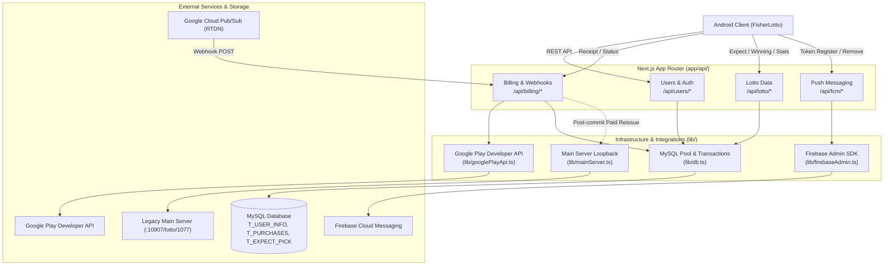

# Lotto Subscription Backend AI Guide

## Start Here

- This guide is a navigation aid and execution safety guard, not a history archive.
- The Obsidian wiki at vault-relative `Dev/Project/Personal/lotto-sub-backend` is the single source of truth for business context, DB contracts, payment flows, deployment details, and decision history. Resolve the vault through `_meta/routing-tables.md` or `obsidian-wiki-sync`, never a hardcoded file URL.
- Before resuming work or making non-trivial changes, follow the mandatory read order:
  1. `README.md` (Wiki entrypoint)
  2. `handoff.md` (Current state and unresolved blockers)
  3. `schema.md` (Project maintenance and evidence rules)
  4. `index.md` (Task navigation)
- Read `issues/needs-verification.md` when the task touches an unsettled claim or verification gap.
- Before multi-step or resumed implementation, ground the wiki context against live code, propose `step → verify` checkpoints, and confirm them before editing.
- Communicate in Korean for explanations and report completion status in Korean.
- Read `docs/ARCHITECTURE.md` and `docs/ADR.md` before changing payment, DB, or external provider logic.
- Repository locations: company `C:\Users\Unionbiometrics\Desktop\dev\1.project\lotto-sub-backend`; main `C:\Users\sumas\OneDrive\Desktop\dev\7.server\lotto-sub-backend`.
- Related client: `FisherLotto` (`<dev-root>/6.project/fisherlotto` or `1.project/FisherLotto`).

## Product and Runtime Pipeline Map

Lotto Subscription Backend is a Next.js App Router API-only backend for the FisherLotto Android app, backed by MySQL, Firebase Cloud Messaging, and Google Play Developer API.



## Module/Domain Map and First Reads

| Domain | Guide / Primary Entry | Ownership & Responsibility | Key Integrations | Related Wiki Topics |
| :--- | :--- | :--- | :--- | :--- |
| **Billing & Subscriptions** | `app/api/billing/receipt/route.ts` | Google Play receipt verification, RTDN Pub/Sub webhook, subscription verification | `lib/googlePlayApi.ts`, `lib/db.ts` | `technical/architecture.md`, `technical/payment-implementation-history.md`, `issues/payment-gaps.md` |
| **Lotto Data & Issuance** | `app/api/lotto/expect/route.ts` | Base (10) and paid (20) expected number lookups, round winning numbers, stats | `lib/db.ts`, `lib/mainServer.ts` | `technical/DB.md`, `technical/design-decisions.md` (ADR-008, ADR-010) |
| **Users & Authentication** | `app/api/users/login/route.ts` | User registration, login, withdrawal, user profile lookup | `lib/db.ts` (`T_USER_INFO`) | `issues/security-and-auth-gaps.md`, `docs/ARCHITECTURE.md` |
| **FCM Push Messaging** | `app/api/fcm/send/route.ts` | User device token registration/removal, server-authorized push sending | `lib/firebaseAdmin.ts`, `lib/db.ts` | `technical/sourcemap.md`, `technical/architecture.md` |
| **Database & Infrastructure** | `lib/db.ts` | MySQL connection pool (`mysql2/promise`), transaction helper, KST time default | MySQL (`T_USER_INFO`, `T_PURCHASES`, `T_EXPECT_PICK`) | `technical/DB.md`, `docs/MIGRATION.md` |

## Task Router

| Request Concern | Read First in Wiki | First Source Path | Then Trace |
| :--- | :--- | :--- | :--- |
| **Google Play Receipt Verification** | `technical/architecture.md`<br>`issues/payment-gaps.md` | `app/api/billing/receipt/route.ts` | `lib/googlePlayApi.ts` → `lib/db.ts` (`T_PURCHASES`, `T_USER_INFO`) → `lib/mainServer.ts` (`requestExpectNumberReissue`) |
| **Google Play RTDN Pub/Sub Webhook** | `technical/architecture.md`<br>`issues/payment-gaps.md` | `app/api/billing/pubsub/route.ts` | `lib/googlePlayApi.ts` (`updateUserTierByToken`) → `lib/firebaseAdmin.ts` (`sendNotificationToUser`) |
| **Expected Numbers (10/30 Split)** | `technical/DB.md`<br>`docs/ADR.md` (ADR-010) | `app/api/lotto/expect/route.ts` | `lib/db.ts` (`T_EXPECT_PICK.pick_expect`, `pay_expect`) → Android response `{ count, lotto }` |
| **User Login & Withdrawal** | `issues/security-and-auth-gaps.md` | `app/api/users/login/route.ts` | `app/api/users/withdraw/route.ts` → `lib/db.ts` (`T_USER_INFO`) |
| **FCM Push Notification & Tokens** | `technical/sourcemap.md` | `app/api/fcm/token/route.ts` | `app/api/fcm/send/route.ts` → `lib/firebaseAdmin.ts` (`admin.messaging()`) |
| **Main-Server Expect Reissue** | `technical/design-decisions.md` (ADR-008) | `lib/mainServer.ts` | `app/api/billing/receipt/route.ts` → `POST :10907/lotto/1077` |
| **Server Deployment & PM2** | `operations/deployment.md` | `.github/workflows/deploy.yml` | Gabia Cloud PM2 restart & smoke test |

## Immutable Boundaries and Change Gates

1. **Zero-Trust Client Payment Gate**: Never trust client-supplied tier or payment values. Verify receipt/subscription state server-side with Google Play Developer API before granting `tier = 1`. `POST /api/users/tier` is permanently deleted (ADR-009) and must never be reintroduced.
2. **Atomic DB Mutation Gate**: Multi-table billing mutations (`T_PURCHASES INSERT` + `T_USER_INFO UPDATE`) must execute inside a MySQL transaction (`connection.beginTransaction()`, `commit()`, `rollback()`, `release()`).
3. **Side-Effect Isolation Gate**: Non-critical network side-effects (FCM push, external main-server loopback `POST /lotto/1077`) must execute strictly outside the DB transaction in isolated `try/catch` blocks. Failures must never roll back or fake-fail an already-committed payment.
4. **Error & Secret Masking Gate**: Never expose DB error messages, SQL exceptions, stack traces, private keys (`FIREBASE_PRIVATE_KEY`), Google service account credentials, or API tokens in API responses.
5. **KST Timezone Invariant Gate**: All application-level date calculations and DB date strings (`valid_date`, `create_time`, etc.) must be strictly interpreted in Korea Standard Time (KST, `+09:00`). Convert Google Play epoch ms/UTC only at ingress/egress boundaries.
6. **Android Client Contract Compatibility Gate**: Preserve Android Lotto Protocol status codes (e.g. `8200`, `8400`, `8611`, `8633`, `8655`, `8677`, `8699`) and backward-compatible JSON shapes. Never alter endpoint contracts without explicit client coordination.
7. **Non-Destructive DB Gate**: Never perform destructive DDL/DML operations (`DROP`, `TRUNCATE`). All schema updates must coordinate with shared DB users and be documented in `docs/MIGRATION.md` and `docs/ADR.md`.

## Build and Verification

```bash
# Lint checks
npm run lint

# Production build & route check
npm run build

# Local development server
npm run dev
```
